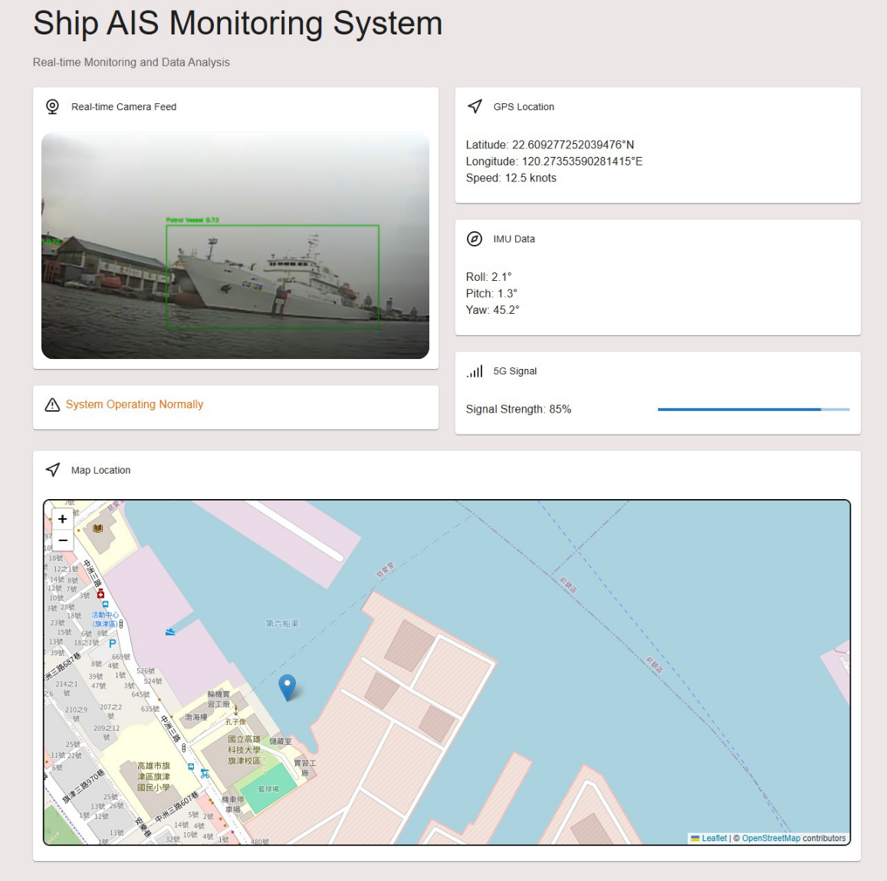
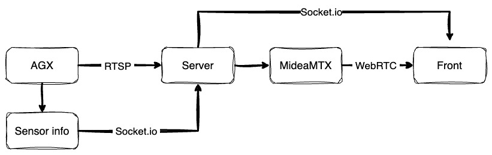

以下是完整的中英對照文檔和可複製的程式碼：

---

# 船舶AIS監控系統文檔 (Ship AIS Monitoring System Documentation)

## 簡介 (Introduction)
**船舶AIS監控系統**是一個實時應用，用於監控和分析船舶數據，包括GPS位置、IMU數據、5G信號強度和即時攝影畫面該應用還集成了動態地圖功能，以可視化顯示船舶的當前位置


`React.js` `Ubuntu` `Jetson AGX`

`UART` `FFMPEG` `MediaMTX`

---

## 相關依賴(Nessary dependencies)

1.Node.js
2.npm

React module

[UI model mui](https://mui.com/material-ui/)
[Map model leaflet](https://react-leaflet.js.org/)
```bash
npm install @mui/material @emotion/react @emotion/styled
```
```bash
npm  install react@rc react-dom@rc leaflet
```
---
## 功能 (Features)
1. **實時攝影機畫面 (Real-time Camera Feed)**
   - 顯示船舶的即時攝影畫面
   - 在示例中為模擬圖像

2. **GPS位置顯示 (GPS Location Display)**
   - 顯示船舶的當前緯度、經度和速度

3. **IMU數據監控 (IMU Data Monitoring)**
   - 顯示船舶的滾轉角(Roll)、俯仰角(Pitch)和偏航角(Yaw)

4. **5G信號強度指示 (5G Signal Strength Indicator)**
   - 以百分比形式顯示當前5G信號強度
   - 包括一個進度條以進行可視化展示

5. **地圖集成 (Map Integration)**
   - 使用交互式地圖顯示船舶的實時位置
   - 在地圖上添加標記和彈出窗口顯示詳細位置信息

6. **串流功能（Streaming）**
   - 使用FFMEPG與MediaMTX
   - 邊緣端以RTSP實現推流
   - 伺服器端以WebRTC實現串流的轉發
7. **子系統通訊（Sub system connection）**
   - 以TTL傳遞UART訊號
---

## 使用技術 (Tech Stack)

### 前端框架與庫 (Frontend Frameworks and Libraries)
1. **React.js**
   - 核心框架，用於構建用戶界面
   - 基於組件的架構實現可重用性和可擴展性

2. **Material-UI (MUI)**
   - 提供預設設計的UI組件，例如`Card`、`Typography`和`LinearProgress`，用於現代化響應式設計

3. **Lucide-React**
   - 圖標庫，用於添加與船舶相關的圖標，例如`Webcam`、`Compass`和`Navigation`

4. **React-Leaflet**
   - 用於在React中集成交互式地圖的輕量級庫
   - 顯示船舶位置，並添加標記和彈出窗口

5. **Leaflet**
   - 一個JavaScript庫，用於渲染交互式地圖

6. **FFMEPG**
   - 用於實現媒體推播與轉撥的工具
   
7. **MediaMTX**
   - 輕量級且低延遲的串流伺服器
---

### 串流技術（streaming）
1. **FFMPEG (Edge端)**
   
   可以透過此指令測試AGX的RTSP推流功能
   ```
   ffmpeg -f x11grab -framerate 30 -video_size 1280x720 -i :0.0 \
   -pix_fmt yuv420p \
   -vcodec libx264 -profile:v baseline -preset ultrafast -tune zerolatency \
   -f rtsp -rtsp_transport tcp rtsp://140.133.74.176:8554/edge_cam
   ```
2. **MediaMTX (Server端)**
   
>[!NOTE] 
> MediaMTX 是一個輕量級串流伺服器，具備低延遲與高穩定性

3. **Sim卡功能**
>[!NOTE] 
> 5G晶片型號：Quectel RM520N-GL
> 
>[Quectel RM520N-GL 驅動](https://github.com/4IceG/RM520N-GL)
>
>先行下載對應版本的 QFirehose＆Firmware
>
>RM520N-GL/Toolz/ & RM520N-GL/Drivers/ 中有測試用的版本

<details><summary>5G晶片燒入</summary>


**步驟 1：下載驅動來源碼**
```
git clone https://github.com/4IceG/RM520N-GL.git
cd RM520N-GL/
```


**步驟 2：安裝必要的依賴套件**
```
sudo apt update
sudo apt install cmake build-essential libusb-1.0-0-dev
```
**步驟 3：編譯5G燒錄韌體**
```
# QFirehose推薦使用自行下載的版本

cd RM520N-GL/tools/qfirehose
mkdir build && cd build
mv /path/to/QFirehose.zip . 
unzip /path/to/QFirehose.zip
cmake ..
make
```

**步驟 4：燒入驅動至5G晶片**
```
mkdir firmware_build && cd firmware_build  
unzip /path/to/Firmware.zip .
sudo ./qfirehose -f /tmp/rm_fw
```
>成功後會顯示 `Upgrade Module successfully`

**步驟 5：確認模組已載入並辨識裝置**
```
lsmod | grep -E 'option|qmi_wwan'
ls /dev/ttyUSB*
dmesg | grep -i ttyUSB
```
**步驟 6：安裝 ModemManager 與 NetworkManager 並啟動服務**
```
sudo apt install modemmanager network-manager
sudo systemctl enable --now ModemManager NetworkManager
```
**步驟 7：建立與啟用 5G 撥號連線（依你的裝置名稱調整 ttyUSBx）**
```
sudo nmcli connection add type gsm ifname '*' con-name 5g-sim apn internet connection.autoconnect yes
sudo nmcli connection up 5g-sim
```


</details>

<details><summary>opencv cmake</summary>


**步驟 1：安裝必要的依賴套件**
```
sudo apt update
sudo apt install -y build-essential cmake git libgtk2.0-dev pkg-config \
libavcodec-dev libavformat-dev libswscale-dev libv4l-dev v4l-utils \
libjpeg-dev libpng-dev libtiff-dev libgstreamer1.0-dev \
libgstreamer-plugins-base1.0-dev libtbb-dev libatlas-base-dev \
python3-dev python3-numpy
```
**步驟 2：下載 OpenCV source code**
```
cd ~
curl -L https://github.com/opencv/opencv/archive/4.5.5.zip -o opencv.zip
curl -L https://github.com/opencv/opencv_contrib/archive/4.5.5.zip -o opencv_contrib.zip
unzip opencv.zip
unzip opencv_contrib.zip
```
**步驟 3：創建cmake所需資料夾與設定檔**
```
cd opencv-4.5.5
mkdir build && cd build
cmake -D CMAKE_BUILD_TYPE=RELEASE \
      -D CMAKE_INSTALL_PREFIX=/usr/local \
      -D WITH_CUDA=ON \
      -D WITH_CUDNN=ON \
      -D CUDA_ARCH_BIN="5.3,6.2,7.2" \
      -D OPENCV_EXTRA_MODULES_PATH=../../opencv_contrib-4.5.5/modules \
      -D WITH_GSTREAMER=ON \
      -D WITH_LIBV4L=ON \
      -D ENABLE_NEON=ON \
      -D BUILD_opencv_python3=ON \
      -D BUILD_TESTS=OFF \
      -D BUILD_EXAMPLES=OFF ..

```
**步驟 4：編譯並安裝**
```
make -j$(nproc)
sudo make install
```
**步驟 5：於終端機中測試是否啟用CUDA**
```
python3 - <<'EOF'
import cv2
print(cv2.cuda.getCudaEnabledDeviceCount())
EOF


```
>回傳不為 `0` 即為成功


</details>
   
<details><summary>設定永久裝置別名</summary>

***步驟 1：查詢當前的USB裝置***

```
ls /dev/ttyUSB*
```
> 視訊類型的USB裝置
```
ls /dev/video*
```

***步驟 2：查詢目標裝置的設備資訊***
```
udevadm info -a -n /dev/ttyUSB0
```
or
```
lsusb
udevadm info /dev/ttyUSB0

```

```
ATTRS{idVendor}=="067b"
ATTRS{idProduct}=="2303"
ATTRS{serial}=="A601XYZ"

#預計回傳
```

***步驟 3：建立 `udev` 規則***
```
sudo nano /etc/udev/rules.d/99-ttl.rules
```
- 貼上以下範本
```
SUBSYSTEM=="tty", ATTRS{idVendor}=="067b", ATTRS{idProduct}=="2303", ATTRS{serial}=="A601XYZ", SYMLINK+="ttl_motion"
```
`代表這條 USB-to-Serial 線材會被指派 /dev/ttl_motion`

***步驟 4：重啟 `udev`***
```
sudo udevadm control --reload-rules
sudo udevadm trigger
```

</details>
<details><summary>Ubuntu services</summary>

---
可以透過Ubuntu services實現開機自動啟用程式碼
---

### 步驟 1 : 創建systemd 服務單元檔案

```
sudo nano /etc/systemd/system/ais-app.service
```
>填寫以下範本
```
[Unit]
Description=AIS Monitoring Service
After=network.target

[Service]
Type=simple
ExecStart=/usr/bin/python3 /home/youruser/path/to/app.py
WorkingDirectory=/home/youruser/path/to/
Restart=always
User=youruser

[Install]
WantedBy=multi-user.target

```
> `/home/youruser/path/to/` 改成實際的 `app.py` 路徑

### 步驟 2：重新載入 systemd 並啟用服務
```
sudo systemctl daemon-reexec
sudo systemctl daemon-reload
sudo systemctl enable ais-app.service
```

### 手動啟動、關閉與重啟服務
```
# 啟動服務
sudo systemctl start ais-app.service

# 關閉服務
sudo systemctl stop ais-app.service

# 重啟服務
sudo systemctl restart ais-app.service

# 查看服務狀態
sudo systemctl status ais-app.service
```

### 步驟 3：設定開機自動啟動
```
sudo systemctl enable ais-app.service
```
> 關閉開機時啟動
```
sudo systemctl disable ais-app.service
```
### 查看運行狀態
```
sudo systemctl status ais-app.service
```


</details>


### 展示（Demo）



---

### 系統流程圖



---


